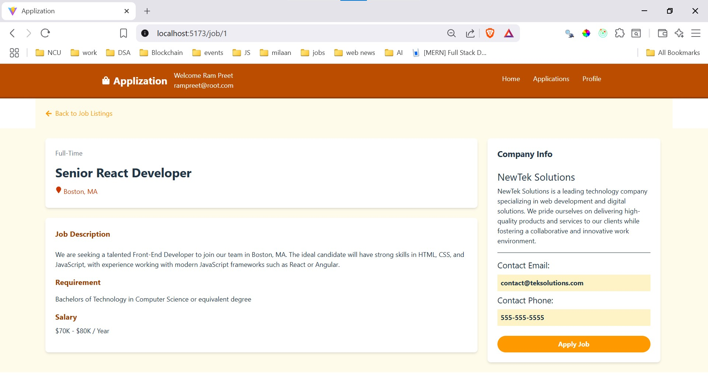
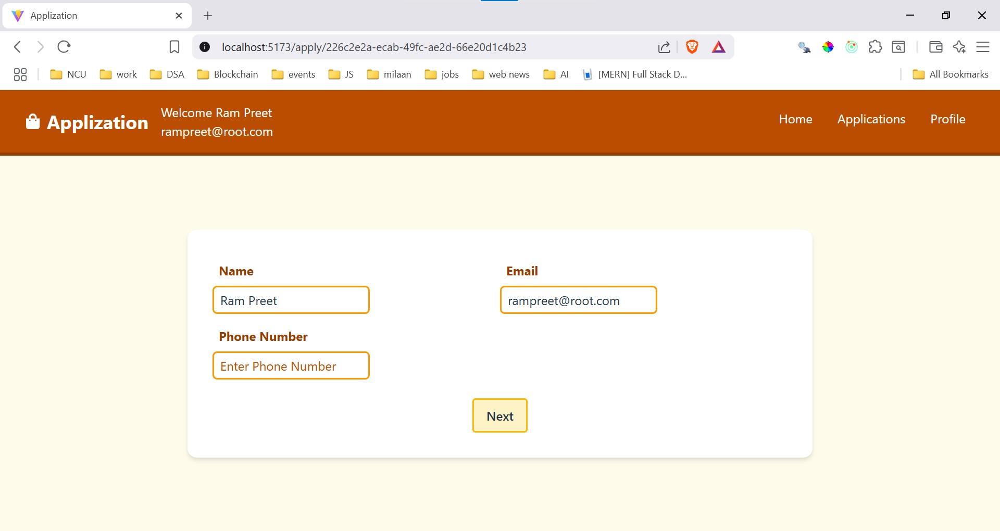
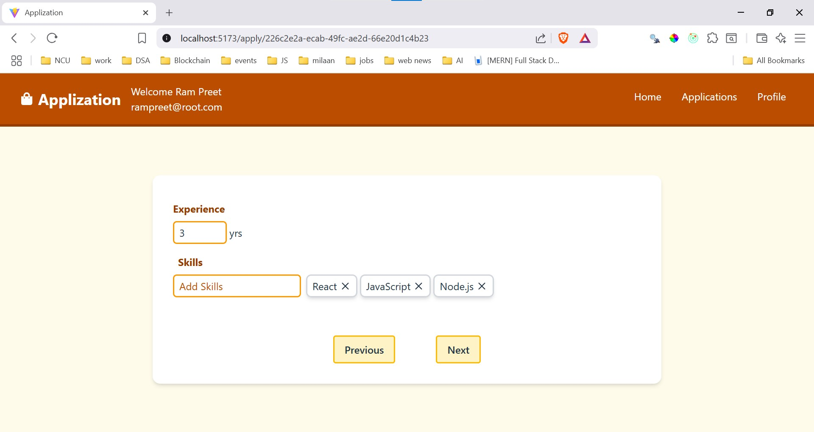
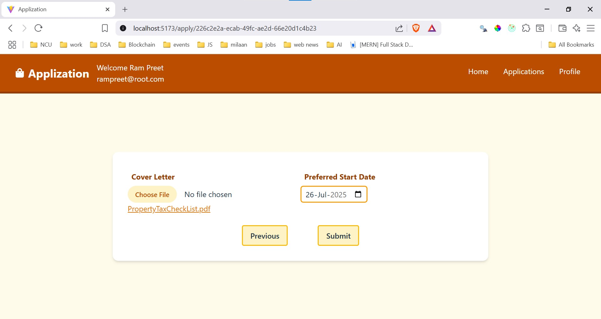
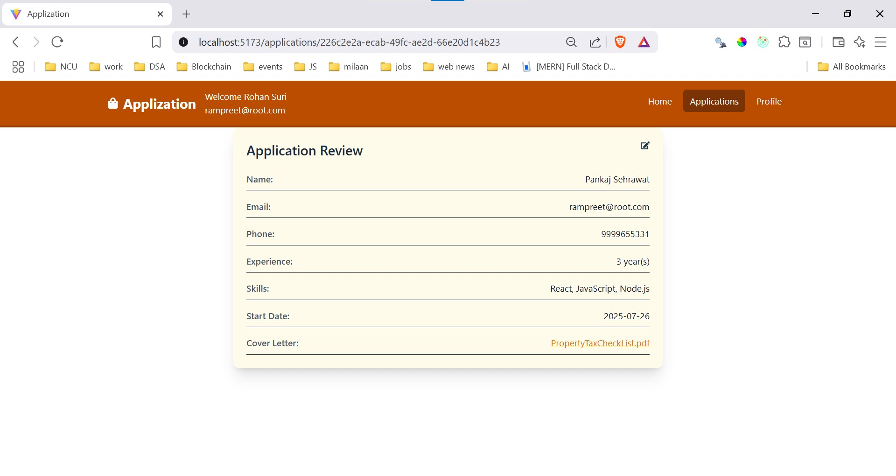
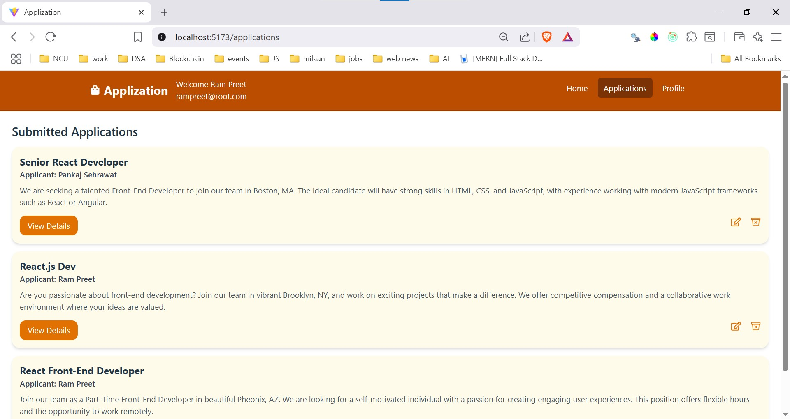

# Job Application React Project Documentation









## Key features:

- apply jobs: Allows a user to apply for a job.
- edit job application details: Allows the user to update the details of an existing job application.
- delete job application: Allows the user to delete a job application.
- see list of jobs applied: User can see list of jobs for which he/she applied.
- update profile: Allows user to update name/email on the profile page.

## Running the Application

```sh
npm install <-- to install required dependencies.
npm run server <-- runs a small server which provides jobs details present in jobs.json file via API [port: 8000]
npm run start <-- starts the vite development server and build tool.
```

## 📚 Key Technologies

- 🌐 react.js: A js library for building server-side rendered and static websites.
- 📘 JavaScript: A dynamic scripting language used for building interactive websites.
- 📚 Redux-Toolkit: A library for managing application state.
- 🎨 Tailwind CSS: A utility-first CSS framework.
- 📝 React-Toastify: A library for adding toast notifications to your React application.
- 📜 json-server: A js module which creates a small server.
